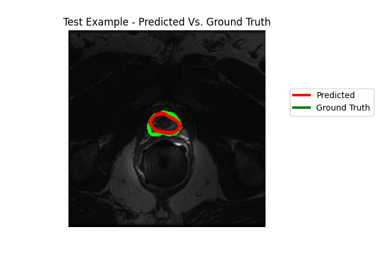

# Segmentation of Prostate MR Images using U-Net architecture
## Abstract
This project includes implementation of Unet-based segmentation algorithm for prostate MR images.
Our goal is to achieve high-score prostate segmentation using the U-Net model,
despite the challenges posed by variations in data from multiple centers, vendors and protocol,
as encountered in our selected dataset.

## Instalation
The environment required to run this project can be downloaded from the "environment.yml".
The installations and experiments were conducted on a system equipped with an NVIDIA GeForce RTX 3090, running CUDA version 12.4.
## Data
We utilized the PROMISE12 dataset, a collection of prostate MR images and segmentation 
masks released as part of MICCAI Grand Challenge for prostate MR image segmentation 
in 2012. The PROMISE12 dataset can be downloaded here: https://promise12.grand-challenge.org/Download/
The dataset includes 50 training cases and 30 test cases. Each case consists of MR images
and their corresponding segmentation masks. Since each file contains a batch of images, we split each file into sub-files, each sub-file
containing a single image or mask (see "First run of the code" section)
## First run of the code
Both in "train.py" and "predict.py" files, set the boolean variable "has_batches" to 'True' 
to create two folders, one for MR images and one for segmentation masks, contain 
separate files for each image and mask, from type ".npy" (instead of a file contains a batch 
of MR images / segmentation masks). After creating the folders, the code terminated and 
needs to re-run for training / predicting.
In every other run, set “has_batches=False” (default value) and run the code.
Download the dataset into a folder named "Data" to ensure competability with the code provided.
## Training
In the "train.py" file, you can choose between different losses:
1. "is_tversky" - if True, apply Tversky loss, otherwise, apply Dice loss.
2. if "is_tversky" == True: $\alpha$, $\beta$ parsers are applied.
3. "is_boundary" - if True, add Boundary loss as a regularization to the original loss.  

Metrics:
1. "is_jaccard" - if True, apply Jaccard score, otherwise, apply Dice score.
2. Hausdorff distance: This metric is automatically calculated during the training loop.
### Evaluation
During training, evaluation over the validation set is also performed using "evaluate" 
function in "evaluate.py" file. No additional variables need to be defined specifically for 
this process. 
* Models are saved into "checkpoints/" folder.
* Loss graphs and Scores graphs (Jaccard/Dice) are saved into "plots/" folder (create this folder in advance).

## Testing
In the "predict.py" file, you can choose between different scores as explained in "Training" section.
* in "args.model" variable, change the path to the desired checkpoint path.
